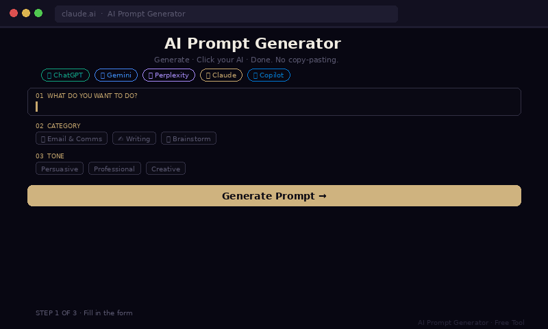

# 🧠 AI Prompt Generator

> **Craft perfect prompts for ANY AI — ChatGPT, Gemini, Claude, Perplexity and more.**
> Built entirely using Claude. No code. Just a conversation.



---

## ✨ What is this?

A free, open-source React tool that helps anyone — technical or not — generate high-quality AI prompts in seconds.

Most people get mediocre results from AI not because the AI is bad, but because the prompt is vague. This tool fixes that.

**You pick:**
- What you want AI to do
- The tone, format, length & audience
- A role/persona for the AI
- What to avoid
- What success looks like

**It generates** a structured, ready-to-use prompt. You copy it. You paste it into any AI. Better results, instantly.

---

## 🚀 Quick Start

### Option 1 — Run in Claude.ai (Easiest, no setup)
1. Sign up free at [claude.ai](https://claude.ai) — no credit card needed
2. Start a new chat
3. Paste the contents of `PromptGenerator.jsx` into the chat
4. Claude renders it as an interactive artifact instantly

### Option 2 — Run in your React project
```bash
# Clone the repo
git clone https://github.com/YOUR_USERNAME/ai-prompt-generator.git

# Install dependencies
npm install

# Add your Anthropic API key
# Create a .env file:
echo "VITE_ANTHROPIC_API_KEY=your_key_here" > .env

# Start the dev server
npm run dev
```

### Option 3 — CodeSandbox (instant, no install)
[](https://codesandbox.io)

Paste `PromptGenerator.jsx` into a new React sandbox and it runs immediately.

---

## 🔑 API Key Setup

This tool uses the **Anthropic Claude API** to generate prompts.

1. Get a free API key at [console.anthropic.com](https://console.anthropic.com)
2. Free tier is available — no credit card required for basic usage
3. Add it to your `.env` file as shown above

> **Note:** When running inside Claude.ai, no API key is needed — it uses Claude's built-in authentication automatically.

---

## 🛠 Tech Stack

| Layer | Tech |
|---|---|
| Framework | React 18 |
| Styling | Inline CSS (no dependencies) |
| AI | Anthropic Claude API (`claude-sonnet-4-20250514`) |
| Fonts | Google Fonts — Playfair Display + DM Mono |
| Audio | Web Speech API + MediaRecorder API |

**Zero external UI dependencies.** Drop it anywhere React runs.

---

## 📦 File Structure

```
ai-prompt-generator/
├── PromptGenerator.jsx   # The entire app — single file
├── README.md             # This file
└── prompt_generator_demo.gif  # Demo GIF for docs
```

---

## 🎙 Features

- **10 categories** — Writing, Coding, Analysis, Brainstorm, Email, Learning, Data, Planning, Translation, Review
- **8 tone options** — Professional, Casual, Concise, Detailed, Creative, Technical, Empathetic, Persuasive
- **8 output formats** — Paragraph, Bullets, Step-by-step, Table, Code, Q&A, Outline, Report
- **Response length control** — Brief, Short, Medium, Long
- **Target audience selector** — Beginner, Intermediate, Expert, Executive, General, Student
- **Role/Persona field** — Tell Claude who to be
- **Extra context field** — Add background info, constraints, examples
- **🎙 Voice input** — Speak into any field instead of typing
- **Works with any AI** — Generated prompts work on ChatGPT, Gemini, Perplexity, Copilot and more

---

## 🌍 Works With Any AI

The tool uses Claude to **write** the prompt. But the prompt itself is plain text — it works everywhere:

| AI Tool | Works? |
|---|---|
| Claude | ✅ |
| ChatGPT | ✅ |
| Gemini | ✅ |
| Perplexity | ✅ |
| Microsoft Copilot | ✅ |
| Any LLM chat interface | ✅ |

---

## 🤝 Contributing

Pull requests welcome! Ideas for contribution:

- [ ] Add prompt history / local storage
- [ ] Add more categories and tones
- [ ] Dark/light theme toggle
- [ ] Export prompts as PDF
- [ ] Multi-language support

---

## 📄 License

MIT — free to use, modify and share.

---

## 🙏 Credits

Built with [Claude](https://claude.ai) by Anthropic.
No developers were harmed in the making of this tool. 😄

---

*If this saves you time, ⭐ star the repo and share it with someone who's been blaming AI for bad results.*
